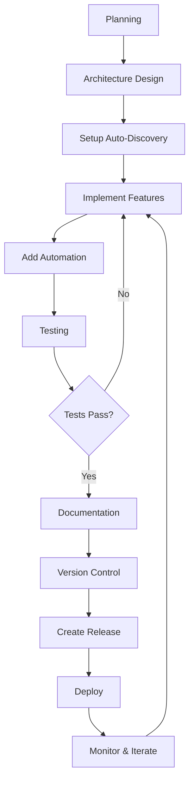

# Ultimate Bak3 - Advanced Blender Texture Baking Addon

[](https://www.blender.org/)
[](https://www.python.org/)
[](LICENSE)

> **A professional showcase of modular architecture and automation patterns for Blender addon development**

Ultimate Bak3 is not just a texture baking tool—it's a **reference implementation** demonstrating advanced software engineering practices in Blender addon development, including auto-discovery, schema validation, error recovery, and zero-maintenance extensibility.

---

## � Key Features

### Core Functionality
- **Advanced Texture Baking**: Multi-pass PBR baking with automated workflows
- **Preset System**: Save and load complete baking configurations
- **Smart Material Application**: Automatic material creation with error recovery
- **UV Management**: Intelligent UV map preparation and activation
- **Auto-Update System**: Seamless addon updates with verification

### 🚀 Advanced Architecture Features

#### 1. **Auto-Discovery System**
Zero-maintenance module registration—add new features without touching initialization code.

```python
# ✨ Automatically discovers and registers ALL modules
addon_modules = get_addon_modules()
for module_name, module_obj in addon_modules:
    module_obj.register()
```

**Benefits:**
- ✅ Add new modules → Instant registration
- ✅ No manual `import` statements
- ✅ No manual `register()` calls
- ✅ Deterministic load order

#### 2. **Schema-Based Validation**
Auto-generates validation schemas from PropertyGroups.

```python
# ✨ Schema auto-extracted from properties
schema = get_property_schema(ADVBAKE_Properties)
is_valid, issues = validate_preset_data(preset, schema)
```

**Benefits:**
- ✅ Presets always compatible with current version
- ✅ No manual schema maintenance
- ✅ Forward/backward compatibility checks

#### 3. **Error Recovery System**
Automatic state snapshots with rollback on failure.

```python
# ✨ Auto-backup before risky operations
snapshot = AutoBackup.create_state_snapshot(obj)
try:
    # ... apply changes ...
except:
    AutoBackup.restore_state_snapshot(obj, snapshot)
```

**Benefits:**
- ✅ Data loss prevention
- ✅ Graceful error handling
- ✅ User-friendly error messages

#### 4. **Console Shortcuts**
Auto-generated Python console shortcuts for rapid testing.

```python
# Instead of: bpy.ops.advbake.auto_bake()
advbake_auto_bake()  # ✨ Auto-registered shortcut
```

**Benefits:**
- ✅ Faster debugging
- ✅ Better developer experience
- ✅ Zero manual registration

---

## 📁 Project Structure

```
Ultimate_Bak3/
├── __init__.py                 # Main entry point with auto-discovery
├── properties.py               # PropertyGroup definitions
├── utils.py                    # Shared utilities
├── auto_utils.py              # 🤖 Automation utilities
│   ├── Schema validation
│   ├── Error recovery (AutoBackup)
│   ├── Metadata generation
│   └── Console shortcuts
│
├── modules/                    # 📦 Feature modules (auto-discovered)
│   ├── __init__.py            # Auto-discovery logic
│   ├── baking.py              # Baking operations
│   ├── images.py              # Image creation
│   ├── materials.py           # Material application
│   ├── presets.py             # Preset management
│   ├── uv.py                  # UV preparation
│   └── update/                # Update system (package)
│       ├── __init__.py
│       ├── ui.py              # Update UI panels
│       ├── operators.py       # Update operators
│       ├── core.py            # Update logic
│       └── validator.py       # Addon verification
│
└── presets/                    # Default presets (JSON)
```

---

## 🏗️ Architecture Patterns

### 1. Modular Design

Each feature is a **self-contained module** with:
- Own operators
- Own UI panels
- Own registration logic
- Clear dependencies

**Example Module Structure:**
```python
# modules/feature.py
import bpy

class ADVBAKE_OT_feature_action(bpy.types.Operator):
    """Feature operator"""
    bl_idname = "advbake.feature_action"
    bl_label = "Feature Action"
    
    def execute(self, context):
        # Implementation
        return {'FINISHED'}

class ADVBAKE_PT_feature(bpy.types.Panel):
    """Feature panel"""
    bl_label = "Feature"
    bl_space_type = 'VIEW_3D'
    bl_region_type = 'UI'
    bl_category = 'Ultimate Bak3'
    
    def draw(self, context):
        # UI layout
        pass

def register():
    bpy.utils.register_class(ADVBAKE_OT_feature_action)
    bpy.utils.register_class(ADVBAKE_PT_feature)

def unregister():
    bpy.utils.unregister_class(ADVBAKE_PT_feature)
    bpy.utils.unregister_class(ADVBAKE_OT_feature_action)
```

### 2. Auto-Discovery Implementation

**`modules/__init__.py`:**
```python
import os
import importlib

# Discover both .py files and packages
_module_dir = os.path.dirname(__file__)
_module_items = []

for item in os.listdir(_module_dir):
    # .py files (modules)
    if item.endswith('.py') and item != '__init__.py':
        _module_items.append(item[:-3])
    # Directories with __init__.py (packages)
    elif os.path.isdir(os.path.join(_module_dir, item)):
        if os.path.exists(os.path.join(_module_dir, item, '__init__.py')):
            _module_items.append(item)

__all__ = sorted(_module_items)

# Auto-import discovered modules
for module_name in _module_items:
    importlib.import_module(f".{module_name}", package=__name__)
```

**Main `__init__.py`:**
```python
def get_addon_modules():
    """Auto-discover feature modules"""
    from . import modules
    import inspect
    
    discovered = []
    for name in dir(modules):
        if name.startswith('_'):
            continue
        attr = getattr(modules, name)
        if inspect.ismodule(attr) and hasattr(attr, 'register'):
            discovered.append((name, attr))
    return discovered

def register():
    # Auto-register all modules
    for module_name, module_obj in get_addon_modules():
        module_obj.register()
```

### 3. Verification System

**Auto-detects ALL components:**
```python
def verify_addon_ready(addon_name):
    """Verify all components loaded"""
    # Auto-detect panels
    all_panels = [name for name in dir(bpy.types) 
                  if name.startswith('ADVBAKE_PT_')]
    
    # Auto-detect operators
    all_operators = [name for name in dir(bpy.types) 
                     if name.startswith('ADVBAKE_OT_')]
    
    # Verify minimum thresholds
    if len(all_panels) < MIN_PANELS:
        return False, f"Missing panels"
    if len(all_operators) < MIN_OPERATORS:
        return False, f"Missing operators"
    
    return True, f"All ready ({len(all_panels)} panels, {len(all_operators)} ops)"
```

---

## 🔧 Adding New Features

### Step 1: Create Module File

```python
# modules/my_feature.py
import bpy

class ADVBAKE_OT_my_action(bpy.types.Operator):
    bl_idname = "advbake.my_action"
    bl_label = "My Action"
    
    def execute(self, context):
        self.report({'INFO'}, "Feature executed!")
        return {'FINISHED'}

class ADVBAKE_PT_my_panel(bpy.types.Panel):
    bl_label = "My Feature"
    bl_space_type = 'VIEW_3D'
    bl_region_type = 'UI'
    bl_category = 'Ultimate Bak3'
    
    def draw(self, context):
        layout = self.layout
        layout.operator("advbake.my_action")

def register():
    bpy.utils.register_class(ADVBAKE_OT_my_action)
    bpy.utils.register_class(ADVBAKE_PT_my_panel)

def unregister():
    bpy.utils.unregister_class(ADVBAKE_PT_my_panel)
    bpy.utils.unregister_class(ADVBAKE_OT_my_action)
```

### Step 2: Done! ✅

That's it! The module is **automatically**:
- ✅ Discovered by `modules/__init__.py`
- ✅ Imported into namespace
- ✅ Registered on addon load
- ✅ Verified by update system
- ✅ Available in console as `advbake_my_action()`

**No changes needed to:**
- ❌ `__init__.py`
- ❌ `modules/__init__.py`
- ❌ Any other files

---

## 🧪 Testing & Validation

### Syntax Validation
```bash
# Validate all Python files
python -m py_compile __init__.py
python -m py_compile modules/*.py
python -m py_compile auto_utils.py
```

### Runtime Verification
The addon automatically verifies itself on load:
```
========================================
Ultimate Bak3 v3.2.6 Loading...
========================================
  → Discovered 6 feature modules
  ✓ Registered: baking
  ✓ Registered: images
  ✓ Registered: materials
  ✓ Registered: presets
  ✓ Registered: update
  ✓ Registered: uv
[Console] Registered 15 shortcuts
✓ Ultimate Bak3 Registered Successfully
```

---

## 📚 Best Practices Demonstrated

### 1. **Zero-Maintenance Registration**
- Auto-discovery eliminates manual imports
- New features require zero boilerplate
- Reduces human error

### 2. **Schema-Driven Validation**
- Properties define the schema
- Validation auto-generated
- Always in sync

### 3. **Defensive Programming**
- State snapshots before mutations
- Automatic rollback on errors
- Detailed error reporting

### 4. **Developer Experience**
- Console shortcuts for testing
- Comprehensive logging
- Clear error messages

### 5. **Scalability**
- Modular architecture
- Clear separation of concerns
- Easy to extend

---

## 🚀 Installation

1. **Download** the latest release
2. **Install** in Blender:
   - Edit → Preferences → Add-ons
   - Install → Select ZIP file
   - Enable "Ultimate Bak3"
3. **Verify** in console:
   ```
   ✓ Ultimate Bak3 Registered Successfully
   ```

---

## � Professional Development Workflow

This section outlines the **complete professional workflow** for developing Blender addons with modular architecture and automation.

### Phase 1: Planning & Architecture 📋

#### Step 1.1: Define Requirements
```
✓ List core features
✓ Identify user workflows
✓ Define success criteria
✓ Plan modular structure
```

#### Step 1.2: Design Module Structure
```python
# Example structure planning
addon_name/
├── __init__.py           # Auto-discovery entry point
├── properties.py         # Shared PropertyGroups
├── utils.py             # Shared utilities
├── auto_utils.py        # Automation helpers
└── modules/             # Feature modules
    ├── __init__.py      # Auto-discovery logic
    ├── feature_a.py     # Self-contained feature
    ├── feature_b.py     # Self-contained feature
    └── feature_c/       # Complex feature (package)
        ├── __init__.py
        ├── ui.py
        └── operators.py
```

**Key Principles:**
- ✅ Each module is self-contained
- ✅ Clear separation of concerns
- ✅ Minimal inter-module dependencies
- ✅ Auto-discovery compatible

---

### Phase 2: Implementation 💻

#### Step 2.1: Setup Auto-Discovery Foundation

**Create `modules/__init__.py`:**
```python
import os
import importlib

_module_dir = os.path.dirname(__file__)
_module_items = []

# Discover .py files and packages
for item in os.listdir(_module_dir):
    if item.endswith('.py') and item != '__init__.py' and not item.startswith('_'):
        _module_items.append(item[:-3])
    elif os.path.isdir(os.path.join(_module_dir, item)) and not item.startswith('_'):
        if os.path.exists(os.path.join(_module_dir, item, '__init__.py')):
            _module_items.append(item)

__all__ = sorted(_module_items)

# Auto-import
for module_name in _module_items:
    importlib.import_module(f".{module_name}", package=__name__)
```

**Create main `__init__.py`:**
```python
import bpy
import importlib
import sys

def get_addon_modules():
    """Auto-discover feature modules"""
    from . import modules
    import inspect
    
    discovered = []
    for name in dir(modules):
        if name.startswith('_'):
            continue
        attr = getattr(modules, name)
        if inspect.ismodule(attr) and hasattr(attr, 'register'):
            discovered.append((name, attr))
    return discovered

def register():
    # 1. Register properties
    properties.register()
    
    # 2. Auto-register modules
    for module_name, module_obj in get_addon_modules():
        module_obj.register()
    
    # 3. Register additional systems (updater, etc.)
    # ...

def unregister():
    # Reverse order
    for module_name, module_obj in reversed(get_addon_modules()):
        module_obj.unregister()
    properties.unregister()
```

#### Step 2.2: Create Feature Module Template

**`modules/feature_template.py`:**
```python
"""
Feature Name - Brief Description
Handles specific functionality.
"""

import bpy
from .. import utils  # Shared utilities

# Operators
class ADDONNAME_OT_feature_action(bpy.types.Operator):
    """Tooltip description"""
    bl_idname = "addonname.feature_action"
    bl_label = "Feature Action"
    bl_options = {'REGISTER', 'UNDO'}
    
    def execute(self, context):
        # Implementation
        self.report({'INFO'}, "Action completed")
        return {'FINISHED'}

# UI Panels
class ADDONNAME_PT_feature(bpy.types.Panel):
    """Feature panel in N-Panel"""
    bl_label = "Feature Name"
    bl_space_type = 'VIEW_3D'
    bl_region_type = 'UI'
    bl_category = 'Addon Name'
    bl_order = 1  # Panel ordering
    
    def draw(self, context):
        layout = self.layout
        props = context.scene.addon_props
        
        # UI layout
        layout.operator("addonname.feature_action")

# Registration
def register():
    bpy.utils.register_class(ADDONNAME_OT_feature_action)
    bpy.utils.register_class(ADDONNAME_PT_feature)

def unregister():
    bpy.utils.unregister_class(ADDONNAME_PT_feature)
    bpy.utils.unregister_class(ADDONNAME_OT_feature_action)
```

#### Step 2.3: Implement Automation Utilities

**Create `auto_utils.py`:**
```python
import bpy
from typing import Dict, List, Tuple

# Schema validation
def get_property_schema(prop_class):
    """Auto-extract schema from PropertyGroup"""
    # Implementation
    pass

def validate_data(data, schema):
    """Validate data against schema"""
    # Implementation
    pass

# Error recovery
class AutoBackup:
    """State snapshot and rollback"""
    
    @staticmethod
    def create_snapshot(obj):
        """Backup object state"""
        return {
            'materials': [m for m in obj.data.materials],
            # ... other state
        }
    
    @staticmethod
    def restore_snapshot(obj, snapshot):
        """Restore from snapshot"""
        obj.data.materials.clear()
        for mat in snapshot['materials']:
            obj.data.materials.append(mat)

# Console shortcuts
def register_console_shortcuts():
    """Auto-register operator shortcuts"""
    import builtins
    for name in dir(bpy.types):
        if name.startswith('ADDONNAME_OT_'):
            # Create shortcut
            pass
```

---

### Phase 3: Testing & Validation ✅

#### Step 3.1: Syntax Validation
```bash
# Validate all Python files
python -m py_compile __init__.py
python -m py_compile properties.py
python -m py_compile utils.py
python -m py_compile auto_utils.py
python -m py_compile modules/*.py

# Check for common issues
python -m pylint modules/ --disable=C,R
```

#### Step 3.2: Runtime Testing
```python
# In Blender Python Console

# 1. Test registration
import bpy
bpy.ops.preferences.addon_enable(module="addon_name")

# 2. Verify auto-discovery
import addon_name
modules = addon_name.get_addon_modules()
print(f"Discovered {len(modules)} modules: {[m[0] for m in modules]}")

# 3. Check panels
panels = [n for n in dir(bpy.types) if n.startswith('ADDONNAME_PT_')]
print(f"Registered {len(panels)} panels")

# 4. Check operators
ops = [n for n in dir(bpy.types) if n.startswith('ADDONNAME_OT_')]
print(f"Registered {len(ops)} operators")

# 5. Test console shortcuts
addonname_feature_action()  # Should work if shortcuts registered
```

#### Step 3.3: Integration Testing
```python
# Test complete workflows
def test_workflow():
    # 1. Load preset
    bpy.ops.addonname.load_preset(preset_id="test")
    
    # 2. Run automation
    bpy.ops.addonname.auto_run()
    
    # 3. Verify results
    assert len(bpy.data.images) > 0
    print("✓ Workflow test passed")
```

---

### Phase 4: Documentation 📚

#### Step 4.1: Code Documentation
```python
# Use comprehensive docstrings
class ADDONNAME_OT_action(bpy.types.Operator):
    """
    Brief description for tooltip.
    
    Detailed description of what this operator does,
    including edge cases and requirements.
    
    Args:
        None (uses context)
    
    Returns:
        {'FINISHED'} on success
        {'CANCELLED'} on failure
    """
```

#### Step 4.2: User Documentation
Create comprehensive README.md with:
- ✅ Feature overview
- ✅ Installation instructions
- ✅ Usage examples
- ✅ Architecture explanation
- ✅ Development guide
- ✅ API reference

#### Step 4.3: Developer Documentation
```markdown
# ARCHITECTURE.md
- Module structure
- Auto-discovery flow
- Extension guidelines
- Best practices

# CONTRIBUTING.md
- Code style guide
- Testing requirements
- Pull request process
```

---

### Phase 5: Version Control & Release 🚀

#### Step 5.1: Git Workflow
```bash
# Initialize repository
git init
git add .
git commit -m "Initial commit: Modular architecture with auto-discovery"

# Feature development
git checkout -b feature/new-module
# ... develop ...
git commit -m "feat: Add new feature module"
git checkout main
git merge feature/new-module

# Versioning
git tag -a v1.0.0 -m "Release v1.0.0"
git push origin v1.0.0
```

#### Step 5.2: Version Bumping
```python
# Update bl_info in __init__.py
bl_info = {
    "name": "Addon Name",
    "version": (1, 0, 0),  # Increment here
    "blender": (2, 93, 0),
    # ...
}
```

**Semantic Versioning:**
- `MAJOR.MINOR.PATCH`
- MAJOR: Breaking changes
- MINOR: New features (backward compatible)
- PATCH: Bug fixes

#### Step 5.3: Release Checklist
```
□ All tests passing
□ Documentation updated
□ Version bumped in bl_info
□ CHANGELOG.md updated
□ Git tag created
□ ZIP file created (without .git, __pycache__)
□ GitHub release published
□ Users notified
```

---

### Phase 6: Deployment & Distribution 📦

#### Step 6.1: Create Release Package
```bash
# Create clean ZIP
cd /path/to/addon
zip -r addon_name_v1.0.0.zip addon_name/ \
    -x "*.git*" \
    -x "*__pycache__*" \
    -x "*.pyc" \
    -x "*/.DS_Store"
```

#### Step 6.2: GitHub Release
1. Go to GitHub → Releases → New Release
2. Tag: `v1.0.0`
3. Title: `Version 1.0.0 - Feature Name`
4. Description:
   ```markdown
   ## What's New
   - ✨ New feature A
   - 🐛 Fixed bug B
   - 📚 Improved documentation
   
   ## Installation
   Download ZIP and install via Blender Preferences
   ```
5. Attach ZIP file
6. Publish

#### Step 6.3: Update System Integration
```python
# In modules/update/operators.py
def check_for_updates():
    """Check GitHub for new releases"""
    import requests
    
    url = "https://api.github.com/repos/user/addon/releases/latest"
    response = requests.get(url)
    latest = response.json()
    
    latest_version = latest['tag_name']
    current_version = f"v{bl_info['version'][0]}.{bl_info['version'][1]}.{bl_info['version'][2]}"
    
    if latest_version > current_version:
        # Notify user
        pass
```

---

### Phase 7: Maintenance & Iteration 🔧

#### Step 7.1: Monitor Issues
- Track GitHub Issues
- Respond to user feedback
- Prioritize bug fixes vs features

#### Step 7.2: Continuous Improvement
```python
# Add telemetry (optional, with user consent)
def log_usage(feature_name):
    """Anonymous usage statistics"""
    # Help prioritize development
    pass
```

#### Step 7.3: Backward Compatibility
```python
# Handle old presets gracefully
def migrate_preset(old_data):
    """Migrate old preset format to new"""
    new_data = old_data.copy()
    
    # Add new fields with defaults
    if 'new_field' not in new_data:
        new_data['new_field'] = default_value
    
    return new_data
```

---

### Complete Workflow Summary



**Time Estimates:**
- Planning: 1-2 days
- Setup: 0.5 day
- Feature Development: 1-2 weeks (varies)
- Testing: 1-2 days
- Documentation: 1 day
- Release: 0.5 day
- **Total**: ~2-3 weeks for initial release

---

## �🛠️ Development

### Prerequisites
- Blender 2.93+
- Python 3.7+

### Setup
```bash
# Clone repository
git clone https://github.com/andiusndd/Ultimate_Bak3.git

# Symlink to Blender addons folder
ln -s $(pwd)/Ultimate_Bak3 ~/blender/scripts/addons/
```

### Hot Reload
```python
# In Blender Python Console
import bpy
bpy.ops.script.reload()
```

---

## 📖 Learning Resources

This addon demonstrates:
- **Modular Architecture**: Feature-based organization
- **Auto-Discovery**: Dynamic module loading
- **Schema Validation**: Type-safe configurations
- **Error Recovery**: Defensive programming
- **Developer Tools**: Console shortcuts, logging

**Study these files to learn:**
- `__init__.py` - Auto-discovery pattern
- `modules/__init__.py` - Module scanning
- `auto_utils.py` - Validation & recovery
- `modules/update/operators.py` - Verification system

---

## 🤝 Contributing

Contributions welcome! This project serves as a reference implementation, so:
- Maintain modular structure
- Follow auto-discovery patterns
- Add comprehensive error handling
- Document architectural decisions

---

## 📄 License

MIT License - See [LICENSE](LICENSE) for details

---

## 🙏 Acknowledgments

Built as a showcase of professional Blender addon development practices, demonstrating:
- Modern Python patterns
- Scalable architecture
- Automation-first design
- Developer-friendly workflows

---

## 📞 Support

- **Issues**: [GitHub Issues](https://github.com/andiusndd/Ultimate_Bak3/issues)
- **Discussions**: [GitHub Discussions](https://github.com/andiusndd/Ultimate_Bak3/discussions)
- **Wiki**: [Documentation](https://github.com/andiusndd/Ultimate_Bak3/wiki)

---

**Made with ❤️ by andiusndd**

*A reference implementation for modern Blender addon development*
